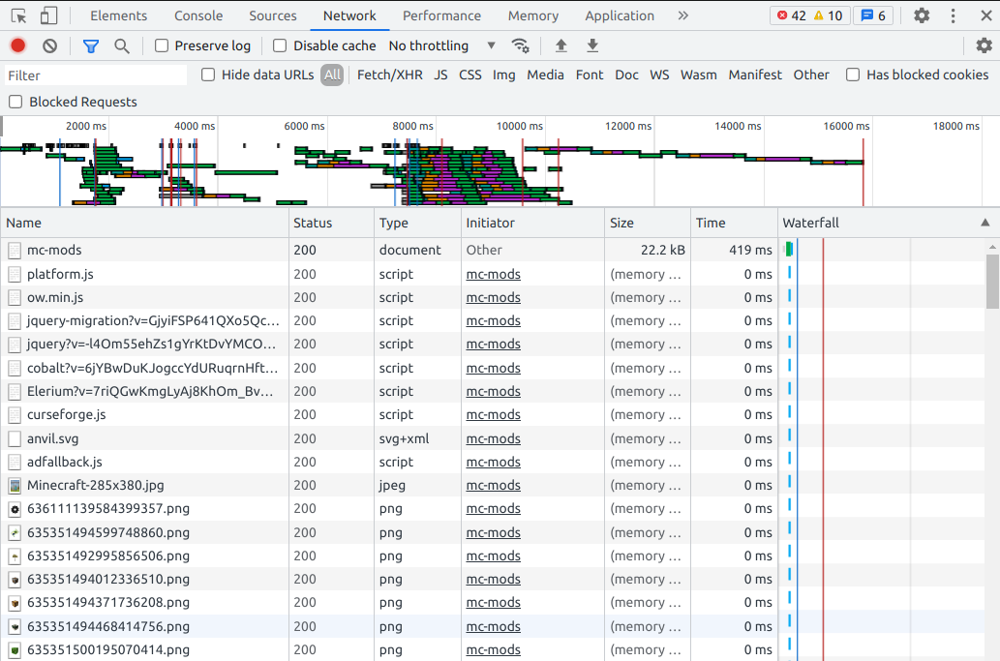

# curseforge-webscraper

A python script that provides functions that scrape minecraft mod information
from [Curseforge](https://www.curseforge.com/minecraft/mc-mods)
with various parameters to configure the scraper.

Required Python Libraries:

```
requests
beautifulsoup4
lxml
```

## How to use

Clone this repo and move `curseforge_webscraper.py` to your project directory.
`import curseforge_webscraper` and call its functions to use it.

## Functions

```
def scrape_curseforge_individual_mod(url: str, cookie: str, output_file_name="individual_mod_data.csv",
                                     file_mode="w+", retry_time=3) -> None:
    """
    Scrapes a specific minecraft mod information from curseforge.com. The scraper takes in the link to the mod and a
    cookie to bypass cloudflare and writes the data to a csv file.

    :param url: link to the mod
    :param cookie: user cookie
    :param output_file_name: name of the output file (defaults to "individual_mod_data.csv")
    :param file_mode: file mode to write the output file ("w+" for overwrite, "a" for append, defaults to "w+")
    :param retry_time: amount of time before requesting to the server again (defaults to 3 seconds)
    :return: None
    """
```

```
def scrape_curseforge_modpages(cookie: str, start_page=1, end_page=1241, rest_time=2,
                               output_file_name="curseforge_mods_data.csv", file_mode="w+") -> None:
    """
    Scrapes general minecraft mod information by page number from curseforge.com. The scraper takes in a cookie to
    bypass cloudflare and writes the data to a csv file.

    :param cookie: user cookie
    :param start_page: first page to be scraped (defaults to 1)
    :param end_page: last page to be scraped (defaults to 1241)
    :param rest_time: amount of time before the scrape requests the next page (defaults to 2 secs)
    :param output_file_name: name of the data file (defaults to "curseforge_mods_data.csv")
    :param file_mode: file mode to write the output file ("w+" for overwrite, "a" for append)
    :return: None
    """
```

## Locate the cookie

Chrome:

- Go to [Curseforge](https://www.curseforge.com/minecraft/mc-mods) -> Inspect (Ctrl+Shift+I) -> Network ->
  Refresh (Ctrl+R) -> Click on the top most row (as shown in the image)
  
- Copy *cookie* under **Request Headers**
- Paste it in the function as a `str`